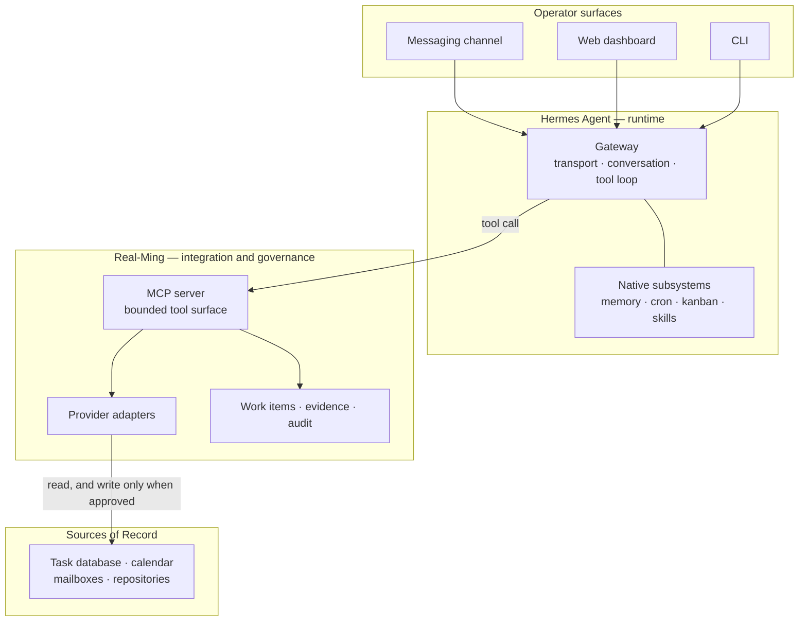

# Real-Ming

A private personal-operations layer built on [Hermes Agent](https://hermes-agent.nousresearch.com/docs) that working 24/7 and hosted on Azure. Hermes is the agent runtime; Real-Ming adds the integrations, governance and coordination that one operator's personal, business, academic and financial work needs.

## Architecture



Real-Ming is reached as a tool. It is never in the path of an ordinary conversation, so plain chat needs no work item, no role ceremony and no structured turn plan.

## What can Real-Ming contribute?

Real-Ming exists as a control plane for agent with defined operating SOP (Agent Mode/Model) , a set of workflow and tools with personalized and customized capability (Agent Skills & MCP) , a Cross-source coordination (Third-party Connectors) , and provide/ingest data as vault(personal information & projects context) of myself in day-to-day task.

Everythings tracked, maintained and presented in a kanban dashboard 

Example of works: Personal operations are spread across systems that each own part of the truth: a calendar, several mailboxes, a task database, a note vault, code repositories. 

It is not a second agent runtime. Building one would mean re-implementing transport, conversation, tool dispatch, scheduling and memory that Hermes already provides — and then maintaining two of everything. That decision is recorded in [ADR-0020](docs/adr/0020-run-ming-on-the-native-hermes-runtime.md) and [ADR-0002](docs/adr/0002-compose-existing-agent-systems.md).

### How a request flows

1. A message arrives on a channel that Hermes owns.
2. Hermes handles it natively — conversation, memory, its own tools.
3. If the request needs one of the operator's systems, Hermes calls a Real-Ming tool.
4. Real-Ming resolves the named account, calls the provider adapter, and records what happened.
5. A consequential result is returned as something to approve, not something already done.

Step 5 is the load-bearing one. A mail tool returns a draft reference and states that the message is waiting; it does not report success for an action nobody authorized.

## Capabilities

| Capability | Status | Notes |
| --- | --- | --- |
| Messaging front door | **Live** | Native Hermes gateway owns the Telegram channel. Real-Ming holds no transport code path in Revision 6. |
| Calendar read and event creation | **Live** | Google Calendar through a provider adapter. |
| Mail search, read, and draft | **Live** | Multiple mailboxes with explicit routing. Drafting only — see [Security and authority](#security-and-authority). |
| Work items and lifecycle | **Tested** | One work-item model across sources; see [ADR-0011](docs/adr/0011-use-one-executive-work-lifecycle.md) and [ADR-0015](docs/adr/0015-converge-tasks-on-one-work-item-model.md). |
| Scheduled reports | **Live** | Composed by Real-Ming, scheduled and delivered by native Hermes cron. |
| Notion task coordination | **Tested** | Master-tasks provisioning, migration rehearsal and cutover CLIs. |
| Backup and restore | **Tested** | Whitelist-only state backup with an isolated restore path. |
| Private operations dashboard | **Live** | Loopback-bound HTTP read model; see [Operations](#operations). |
| Curated-knowledge guarantees | **Partial** | Versioned publication, contradiction quarantine and cross-domain projection are built and controlled-tested but not wired to a production caller. Revision 6 makes them optional; see [ADR-0018](docs/adr/0018-compile-knowledge-into-trust-domain-vaults.md). |
| Selective wiki consolidation | **Tested (controlled only)** | Tasks 0–8 are implemented and controlled-tested with native Hermes as the sole reasoning/memory runtime; the inactive `02:00 Asia/Kuala_Lumpur` manifest is not a cron row. No production caller, live acceptance or local mirror is active. See [ADR-0022](docs/adr/0022-native-knowledge-consolidation-around-hermes.md), the [implementation plan](docs/superpowers/plans/2026-09-09-native-knowledge-consolidation.md) and [controlled evidence](docs/evidence/native-knowledge-consolidation-controlled-acceptance-2026-09-09.md). |
| Event-driven mandatory controls | **Planned** | No runtime hook or event wiring exists in this repository today. Current deterministic guarantees come from build-time checks and from tool capability being absent rather than forbidden. |

### Responsibility boundary

| Hermes owns | Real-Ming owns |
| --- | --- |
| Messaging transport and channel adapters | Provider adapters for the operator's own accounts |
| Conversation state and the tool loop | The work-item model and its lifecycle |
| Model selection, memory, skills, plugins | Scheduled report composition |
| Scheduling and delivery | Evidence, audit records and derived projections |
| The web dashboard and kanban surfaces | Approval-bearing semantics for consequential actions |

Real-Ming states no opinion about Hermes's own features. It previously pinned Hermes memory settings and those were removed rather than set permissively, because gating the runtime's working memory costs answer quality without buying safety. The reasoning is preserved in [`hermes/config.native-first.example.yaml`](hermes/config.native-first.example.yaml), and a test fails the build if a memory opinion reappears in that fragment.

The selective knowledge-consolidation implementation is additive and
controlled-tested, but not production-wired or active. It must not change
native memory, inspect every ordinary conversation, or be described as a hard
security boundary for arbitrary filesystem reads. The Azure-hosted vault is
canonical; any future local Obsidian mirror is an optional one-way,
activation-triggered, read-only projection, never an upstream or runtime
dependency. Its contract and evidence are in [the design spec](docs/superpowers/specs/2026-09-08-native-knowledge-consolidation-design.md),
[ADR-0022](docs/adr/0022-native-knowledge-consolidation-around-hermes.md) and
[the controlled acceptance record](docs/evidence/native-knowledge-consolidation-controlled-acceptance-2026-09-09.md).

## Status

**Real-Ming v1.1, Architecture Revision 6.** Single operator, private repository, not a general-purpose product and not accepting external users.

Revision 6 is the design baseline: Hermes owns the messaging gateway, conversation and execution, and Real-Ming is an additive extension reached as a tool. The deployed revision is tracked separately in [docs/BASELINE.md](docs/BASELINE.md) and is allowed to lag the design; a test fails the build if the two labels drift apart.

Capabilities below are labelled by evidence:

| Label | Meaning |
| --- | --- |
| **Live** | Implemented, tested, and exercised against real accounts |
| **Tested** | Implemented with automated tests; not exercised end to end in production |
| **Partial** | Implemented but not wired to a production caller |
| **Planned** | Designed and documented only |

## Sources of Record and account routing

External applications remain authoritative. Real-Ming coordinates access and keeps evidence; it does not shadow another system's truth or quietly become the new one. See [ADR-0001](docs/adr/0001-keep-domain-systems-authoritative.md).

Account routing is explicit. Several mailboxes are configured separately and named by the caller, and there is no implicit default. A request for one mailbox is never served from another, and a mailbox this process holds no token for is refused rather than substituted.

**A connector failure is an access failure, not an empty result.** An adapter that cannot authenticate reports that it could not look, which is a different answer from "there is nothing there" and must not be collapsed into one.

## Security and authority

The authority model is defined in [CONTEXT.md](CONTEXT.md) and [ADR-0004](docs/adr/0004-enforce-tiered-agent-authority.md). In short:

- **Approval** is an explicit decision authorizing one bounded action or one exact artifact version. Acknowledgement is not approval.
- **Standing Authority** is a revocable policy pre-authorizing a defined class of reversible, low-risk actions within stated limits.
- Anything outward-facing or hard to reverse stops and asks.

Some boundaries are structural rather than instructional, which is the stronger form:

- **Drafting an email never sends it.** No send tool exists in the tool surface. The capability is absent, not merely discouraged.
- **No agent moves money or places a trade.** This is a standing constraint on the system, not a runtime check.
- **Secrets are read by name, never by literal.** Values live only in an ignored `.env` file or a secret store. A test in the standard check scans every tracked file for credential-shaped material.
- **Default tests never contact a provider**, spend quota, use a credential, or touch production data. Live smoke tests require both an explicit flag and supplied credentials.

Deterministic enforcement today comes from build-time guards — the deployment preflight, the baseline drift test, the credential scanner — and from bounded tool capability. Enforcement through runtime events or hooks is a design goal, not a current feature; see the **Planned** row above.

## Prerequisites

| Requirement | Check | Notes |
| --- | --- | --- |
| Node.js >= 24 | `node --version` | Declared in [`package.json`](package.json) `engines` |
| Chromium for the browser test | `npx playwright install chromium` | `npm run check` runs a real browser test and fails rather than skips when Chromium cannot launch |
| A `.env` file | `npm run secrets:preflight` | Reports variable **names** only |
| GitHub CLI, for repository workflows | `gh auth status` | Used by the issue-tracker workflow described in [AGENTS.md](AGENTS.md) |

The browser test failing loudly is deliberate. A silent skip would let the dashboard read model go unproven while the suite still reported green.

## Quick start

```bash
npm install
cp .env.example .env
```

Fill in `.env` from [`.env.example`](.env.example), which lists every variable with its purpose. Then confirm the environment resolves without printing any value:

```bash
npm run secrets:preflight
```

Then run the full check — type-check, tests, build, and the deployment preflight:

```bash
npm run check
```

This is offline. It contacts no provider and needs no credentials beyond what `secrets:preflight` reports as present.

## Configuration

All configuration is environment variables, documented by name in [`.env.example`](.env.example). They group as:

| Group | Purpose |
| --- | --- |
| `REAL_MING_HERMES_*` | Runtime composition — base URL, model, provider, state and session paths |
| `REAL_MING_TELEGRAM_*` | Channel identity and ownership mode |
| `REAL_MING_GOOGLE_*`, `REAL_MING_MAIL*`, `REAL_MING_*_MAILBOX` | Calendar and per-mailbox routing |
| `REAL_MING_NOTION_*` | Task database coordination |
| `REAL_MING_GITHUB_READ_TOKEN`, `REAL_MING_VERCEL_READ_TOKEN` | Read-only project lineage |
| `REAL_MING_STATE_PATH`, `REAL_MING_*_BACKUP_*` | Durable state and backup targets |
| `REAL_MING_AZURE_KEY_VAULT_NAME` | Secret store; values resolve at runtime rather than resting on disk |
| `REAL_MING_LIVE_SMOKE` | Opt-in flag for tests that contact real providers |

Ownership variables such as `REAL_MING_TELEGRAM_OWNERSHIP` and `REAL_MING_SCHEDULER_OWNERSHIP` select which system owns a channel or a schedule. They exist to keep exactly one consumer per channel and one owner per job.

## Running

Start the Real-Ming control plane, which serves the operations read model:

```bash
npm run control-plane:start
```

Serve the MCP tool surface, which is how Hermes reaches Real-Ming:

```bash
npm run mcp:serve
```

Hermes itself is configured separately. The version-controlled, secret-free configuration pack lives in [`hermes/`](hermes/README.md), including the operator's skills and the native-first configuration fragment.

## Verification

```bash
npm run check                          # type-check, tests, build, deployment preflight
npm run control-plane:deployment-preflight   # unit-file and command-shape guards only
npm run graph:status                   # validate the ticket graph and name the next unblocked node
```

`npm run control-plane:smoke` exercises a live deployment and requires credentials and a reachable host; it is not part of the default check.

The deployment preflight asserts the exact shape of the deployed service units — bind addresses, ports, writable state paths and required environment. It exists because a service can be correct on disk and wrong inside its sandbox, and that failure mode has occurred here more than once.

## Development and testing

```bash
npm test          # vitest run
npm run test:watch
npm run typecheck
```

Tests run through **two approved seams only**:

- [`src/testing/real-ming-system-harness.ts`](src/testing/real-ming-system-harness.ts) — system behaviour
- [`src/testing/provider-adapter-contract-harness.ts`](src/testing/provider-adapter-contract-harness.ts) — provider adapter contracts

Do not add a third seam and do not test internals. Work proceeds red-to-green through those harnesses; the reasoning and the wider working agreement are in [AGENTS.md](AGENTS.md).

The suite is 71 test files under [`test/`](test), covering system behaviour, adapter contracts, documentation invariants, the ticket graph, and one real browser test for the dashboard read model.

## Repository structure

| Path | Contents |
| --- | --- |
| `src/` | TypeScript sources — adapters, integration, runtime, dashboard, operations |
| `src/integration/` | The MCP tool surface Hermes calls |
| `src/providers/` | Provider adapters for calendar, mail, tasks, repositories, storage |
| `src/testing/` | The two approved test harnesses |
| `test/` | Test suites, grouped by seam and by subject |
| `hermes/` | Version-controlled, secret-free Hermes configuration and operator skills |
| `deploy/` | Service units, host preparation and backup scripts |
| `docs/adr/` | Architecture decision records |
| `docs/specs/` | The system specification |
| `docs/evidence/` | Milestone outcomes, test and audit evidence |
| `docs/planning/` | Implementation plans and requirement ledgers |
| `CEO-Office/` | Runbooks and approvals requiring the operator's own hand |
| `CONTEXT.md` | Domain vocabulary, roles and authority definitions |
| `AGENTS.md` | Working agreement for agents contributing to this repository |

## Operations

The system runs on an always-on Linux host under systemd, with unit files in [`deploy/systemd/`](deploy/systemd). Both the Hermes dashboard and the Real-Ming read model bind to loopback only; neither is published to the internet and no public dashboard or SSH port is opened.

Remote access is over a private network with authentication in front of it, rather than by exposing a port. The current arrangement and the reasoning behind it are recorded in [ADR-0021](docs/adr/0021-reach-the-dashboard-over-tailscale-with-nous-oauth.md).

Backups are whitelist-only and restore into an isolated location so a restore cannot overwrite live state by accident.

## Limitations and non-goals

- **Single operator by design.** [ADR-0008](docs/adr/0008-optimize-v1-for-one-operator.md) optimizes v1 for one person. Multi-user access control is not implemented.
- **Not a general-purpose agent framework.** If a capability exists natively in Hermes, Real-Ming should not reimplement it, and several previous Real-Ming components were deleted on those grounds.
- **No autonomous outward action.** Sending, publishing, deploying and spending all stop for approval.
- **No runtime event enforcement yet.** Deterministic guarantees are build-time and capability-shaped; see the **Planned** row in [Capabilities](#capabilities).
- **Deployment is specific to this installation.** The scripts under `deploy/` assume one host and one cloud account; they are not a portable installer.
- **No CI workflows in this repository.** Checks run locally through `npm run check`.

## Documentation

| Document | What it covers |
| --- | --- |
| [CONTEXT.md](CONTEXT.md) | Domain vocabulary, executive roles, authority definitions |
| [AGENTS.md](AGENTS.md) | Working agreement, definition of done, secrets policy |
| [docs/BASELINE.md](docs/BASELINE.md) | Current design and deployed revision labels |
| [docs/specs/real-ming-v1.1.md](docs/specs/real-ming-v1.1.md) | The system specification |
| [docs/adr/](docs/adr) | Twenty-one decision records, oldest to newest |
| [docs/architecture/](docs/architecture) | Capability and architecture reviews |
| [docs/agents/](docs/agents) | Agent guidance, handoffs, lessons learned |
| [hermes/README.md](hermes/README.md) | The Hermes configuration pack |

For how Hermes itself behaves, the authoritative reference is the [Hermes Agent documentation](https://hermes-agent.nousresearch.com/docs).
