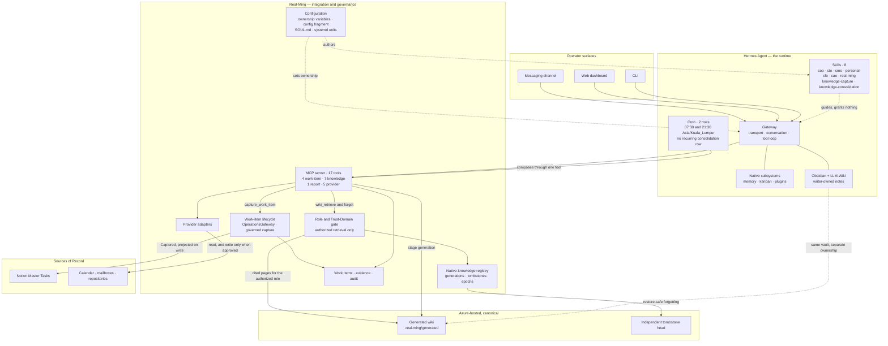

# Real-Ming

A private personal-operations layer built on [Hermes Agent](https://hermes-agent.nousresearch.com/docs). Hermes is the agent runtime; Real-Ming adds the integrations, governance and evidence that one operator's personal, business, academic and financial work needs.
The intended always-on deployment target is an Azure VM with Azure Key Vault; deployment and live-acceptance status are tracked separately from this design baseline.

## What can Real-Ming contribute?

Real-Ming exists as a operating layer for agent with defined configuration (Agent Mode) , a set of workflow and tools with personalized & customized capability (Agent Skills & MCP) , a Cross-source coordination (Third-party Connectors) , and provide/ingest data as vault (personal & projects Knowledge Base) of myself in day-to-day task.

Everythings tracked, maintained and presented in a kanban dashboard 
## Status

The deployed revision is tracked separately in [docs/BASELINE.md](docs/BASELINE.md) 

Capabilities below are labelled by evidence:

| Label | Meaning |
| --- | --- |
| **Live** | Implemented, tested, and exercised against real accounts |
| **Tested** | Implemented with automated tests; not exercised end to end in production |
| **Partial** | Implemented but not wired to a production caller |
| **Planned** | Designed and documented only |

## Capabilities

| Capability | Status | Notes |
| --- | --- | --- |
| Messaging front door | **Live** | Native Hermes gateway owns the Telegram channel. Real-Ming holds no transport code path in Revision 6. |
| Calendar read and event creation | **Live** | Google Calendar through a provider adapter. |
| Mail search, read, and draft | **Live** | Multiple mailboxes with explicit routing. Drafting only — see [Security and authority](#security-and-authority). |
| Scheduled reports | **Live** | Composed by Real-Ming, scheduled and delivered by native Hermes cron. |
| Private operations dashboard | **Live** | Loopback-bound HTTP read model; see [Operations](#operations). |
| Native knowledge notes | **Live** | Hermes's own bundled Obsidian and LLM-Wiki skills write cited Markdown into the vault on the host; a note survived a service restart, was retrieved from a later session and restored byte-identical from backup. The writer-owned part of the vault holds one agent-written note today — a working write/retrieve path, not a populated second brain. The governed generated tree in the next row lives beside it under `.real-ming/`, separately owned. |
| Role-scoped selective native knowledge | **Live** | Governed generation and publication, role- and Trust-Domain-gated retrieval, and restore-safe forgetting backed by an independent Azure tombstone head — invoked by native Hermes through the production MCP surface. In the 14 September acceptance run native Hermes retrieved citation `issue:54/live-acceptance-live` for Trust Domain `Ming Creatives`; the same request made as `Personal CFO` was refused as unauthorized; and forgetting subject `rm54-live-acceptance-alpha` left retrieval continuous at tombstone-head epoch 1. **Recurring consolidation remains disabled** — the `02:00 Asia/Kuala_Lumpur` manifest is still an inactive manifest and not a cron row, and only the two report jobs recur. **Retrieval is a literal, contiguous substring match, not keyword or semantic search** — `wiki_retrieve` lowercases the query and tests whether the page id, path, citation and body contain that exact string. `role-scoped native knowledge` matches the live page; `RM-54 live acceptance` does not, because that phrase appears nowhere in it. A natural-language question will usually return nothing, and the agent correctly declines to invent an answer rather than guessing. Ranked or token-based search is not implemented. This is a **different system** from the legacy curated vault below, which stays optional and unwired. See [ADR-0022](docs/adr/0022-native-knowledge-consolidation-around-hermes.md), [ADR-0023](docs/adr/0023-scope-native-knowledge-retrieval-by-trust-domain.md) and the [RM-54 live evidence](docs/evidence/RM-54-live-operations-and-knowledge-2026-09-14.md). |
| Work items and lifecycle | **Live** | One work-item model across sources, now reached from native Hermes through the governed `real_ming_capture_work_item` tool. Capture runs the existing `OperationsGateway` lifecycle rather than a second or bypass path, so it can create `Captured` work but cannot execute or complete it. Live acceptance captured Work Item `8d78fde1-45b3-4377-b89b-dd04d38636cc` in state `Captured`, and a replay on idempotency key `rm54-live-work-item-notion-v1` returned the same ID as `deduplicated`. See [ADR-0011](docs/adr/0011-use-one-executive-work-lifecycle.md), [ADR-0015](docs/adr/0015-converge-tasks-on-one-work-item-model.md) and the [RM-54 live evidence](docs/evidence/RM-54-live-operations-and-knowledge-2026-09-14.md). |
| Notion task coordination | **Live** | Master-tasks provisioning, migration rehearsal and cutover CLIs, plus the live Master Tasks projection. The RM-54 capture waited on the real provider write rather than a local queue acknowledgement: the item landed on Notion page `3db89b83-bac5-81b6-8b28-df768d840c9e` with one version recorded, so a failed projection would have failed the call. **On the board it appears in the `Captured` column** — `master-tasks.ts` writes the Real-Ming lifecycle state, and the Master Tasks database uses lifecycle names. Note that `real_ming_get_work_item` separately reports a `notionCategory` of `Pending`, which is the *legacy* category vocabulary from [`notion-task-status-semantics.md`](docs/agents/notion-task-status-semantics.md) and does **not** name a column on the current board; the two vocabularies mean the same state. |
| Backup and restore | **Live** | Whitelist-only state backup with an isolated restore path, now covering the live native-knowledge registry. The 14 September protected backup and its isolated restore verified 24 files and 11 SQLite stores, recovering the registry at publication epoch 2 and tombstone-head epoch 1 together with the generated wiki tree. Credentials, OAuth material and caches never enter the snapshot. |
| Legacy curated-knowledge vault | **Partial — retained, optional** | Not the live row above, and not a stage of it. The original design: an encrypted, versioned vault over six trust-domain roots (`Personal/`, `Ming-Creatives/`, `Academic/`, `Finance/`, `Entertainment/`, `CEO/`) with an LLM-wiki folder shape, Candidate Envelope quarantine and a Projection Broker, each executive perspective reading its own root. Built and controlled-tested. **Not in production and not partially in production:** no production entrypoint passes `knowledgeOperations`, so the vault, the knowledge compiler, the Projection Broker and the Obsidian materializer are all constructed as `undefined` and never run; `REAL_MING_VAULT_KEY` is not even passed into the container. `REAL_MING_OBSIDIAN_ROOTS` *is* set on the host — to `CEO`, one root rather than six — but it only shapes an options object nothing consumes. Verified 14 September 2026: the configured `/var/lib/real-ming/obsidian` directory holds **0 files**, and none of the six trust-domain folders exist. Revision 6 makes it optional; see [ADR-0018](docs/adr/0018-compile-knowledge-into-trust-domain-vaults.md). The live role-scoped path above meets its own narrower guarantee and does not activate this one. |
| Event-driven mandatory controls | **Planned** | No runtime hook or event wiring exists in this repository today. Current deterministic guarantees come from build-time checks and from tool capability being absent rather than forbidden. |

### Executive perspectives

Five bounded perspectives shape how work is framed. Each is a Hermes skill in [`hermes/skills/ming/`](hermes/skills/ming), loaded on merit when the work matches.

| Perspective | Scope |
| --- | --- |
| **COO** | Daily operations, life, career and coordination |
| **CTO** | Software, infrastructure and technical operations |
| **CMO** | Content, research, production and distribution |
| **Personal CFO** | Finance, accounting and analytical snapshots |
| **CAO** | Academic commitments, planning and draft support |

They are perspectives, not agents. There is no process, inbox, runtime or storage
folder per role, and a role label is not a security boundary — authority comes
from the approval model, not from which playbook happens to be active. Real-Ming
records role metadata on tracked work; ordinary conversation selects no role at
all and announces none.

The Personal CFO advises and may perform approved record changes. It never
initiates money movement, and no perspective can — that limit is a property of
the tool surface, not of the playbook text.


## Architecture



Real-Ming reaches Hermes two ways, and the direction matters. **Configuration and
skills flow into Hermes** — Real-Ming authors them, Hermes loads them, and neither
carries a credential or grants a permission. **Tools are called out of Hermes** —
the gateway decides when, and cron composes the two daily reports through one of
them while Hermes keeps the schedule and the delivery.

Real-Ming is reached as a tool. It is never in the path of an ordinary conversation, so plain chat needs no work item, no role ceremony and no structured turn plan.

### What Real-Ming actually ships
| Mechanism | Deployed | What it is |
| --- | ---: | --- |
| **Configuration** | — | A secret-free Hermes config fragment, `SOUL.md`, ownership variables (`REAL_MING_TELEGRAM_OWNERSHIP`, `REAL_MING_SCHEDULER_OWNERSHIP`) and the systemd units. It states no opinion about Hermes memory. |
| **Skills** | **8** | Five role playbooks — `coo`, `cto`, `cmo`, `personal-cfo`, `cao` — plus `real-ming` for vocabulary, authority and portfolio, and the two knowledge skills `knowledge-capture` and `knowledge-consolidation`. Guidance only: no skill carries a credential or grants a permission. |
| **MCP tools** | **17** | 4 work-item, capture and execution-link · 7 native-knowledge · 1 scheduled-report · 5 provider access, over one stdio server. |
| **Scheduled jobs** | **2** | Native Hermes cron rows at 07:30 and 21:30 `Asia/Kuala_Lumpur`. Real-Ming composes through one tool; Hermes owns the schedule and the Telegram delivery. Knowledge consolidation adds no third row: its manifest stays inactive. |

**The repository and the host now agree.** Since 14 September 2026 the host
exposes the same **17 tools and 8 skills** this repository holds in
[`hermes/skills/ming/`](hermes/skills/ming): on the host,
`hermes mcp test real-ming` discovers 17 tools and the deployed
`skills/ming/` directory carries 8. The
seven native-knowledge tools — `capture_knowledge_candidate`,
`knowledge_list_candidates`, `read_knowledge_source`,
`stage_knowledge_generation`, `wiki_retrieve`, `forget_wiki_knowledge`,
`knowledge_health` — and the two knowledge skills are deployed and live.

**Deployed is still not the same as recurring.** A narrower scope exists in
code for a nightly job restricted to four operations — list candidates, read
source, stage generation, wiki retrieve. That wrapper has been exercised
successfully in production as a one-shot, but **no recurring job runs it**: the
only two cron rows remain the 07:30 and 21:30 reports.

Five of the seventeen deployed tools are provider access, which a native connector
could also perform. They exist for governance rather than capability: there is
no send tool and no `gmail.send` scope, and the MCP child holds no Google
credential or Key Vault access, calling a loopback endpoint where per-account
tokens and the mailbox allowlist are enforced. The genuinely Real-Ming-shaped
tools are the work-item, capture, execution-link, report and native-knowledge
ones.

## Production topology

One always-on Linux virtual machine in Azure (Malaysia West) runs everything, under
systemd, with unit files in [`deploy/systemd/`](deploy/systemd). Native Hermes and
the Real-Ming extension are separate processes on that single host — the isolation
is for clean execution and recovery, not a hardened multi-tenant boundary.

| Element | Detail | State |
| --- | --- | --- |
| Always-on host | One Azure Linux VM under systemd; restart and reconcile verified with nothing lost and nothing replayed | live-verified |
| Native Hermes gateway | Sole Telegram consumer; owns conversation, tools, cron, kanban and native memory | live-verified |
| Real-Ming extension | Separate process, same host; 17 MCP tools reached over local stdio | live-verified |
| Hermes dashboard | Bound to `127.0.0.1:9119` | live-verified |
| Real-Ming read model | Bound to `127.0.0.1:8787` | live-verified |
| Private remote access | Approved devices only, over a private network behind OAuth. No public dashboard or SSH port is opened | live-verified |
| Secrets | Azure Key Vault, resolved at runtime; no copy rests on the host disk | live-verified |
| Scheduled reports | Two native Hermes cron jobs delivering to Telegram; one unattended run observed | live-verified |
| Off-host backup | Azure Blob Storage in a separate region, whitelist-only, with an isolated restore proven byte-identical | live-verified |
| Role-scoped selective native knowledge | Deployed and exercised in production: governed publication, role/Trust-Domain-gated retrieval and restore-safe forgetting | live-verified |
| Recurring knowledge consolidation | Inactive manifest only; no cron row exists | deliberately disabled |
| Native-knowledge registry | `/var/lib/real-ming/native-knowledge.sqlite`, included in the protected backup and recovered by isolated restore | live-verified |
| Independent tombstone head | Azure object read and written through managed identity, separate from the registry | live-verified |
| Optional local worker | A laptop process for device-specific work; nothing depends on it | intended |

## What can Real-Ming contribute?

Real-Ming is the integration and governance layer around Hermes. It contributes operator-specific SOPs and configuration, bounded skills and MCP tools, cross-source provider coordination, evidence and audit records, and projections such as the private dashboard. Hermes remains the agent: it owns Telegram, conversation, tool dispatch, scheduling, kanban, plugins, skills, native memory and final responses.

Every item remains attributable to its source of record and is shown through an operational read model; Real-Ming does not recreate Hermes or silently shadow provider truth.

### Responsibility boundary

| Hermes owns | Real-Ming owns |
| --- | --- |
| Messaging transport and channel adapters | Provider adapters for the operator's own accounts |
| Conversation state and the tool loop | The work-item model and its lifecycle |
| Model selection, memory, skills, plugins | Scheduled report composition |
| Scheduling and delivery | Evidence, audit records and derived projections |
| The web dashboard and kanban surfaces | Approval-bearing semantics for consequential actions |

Real-Ming states no opinion about Hermes's own features. It previously pinned Hermes memory settings and those were removed rather than set permissively, because gating the runtime's working memory costs answer quality without buying safety. The reasoning is preserved in [`hermes/config.native-first.example.yaml`](hermes/config.native-first.example.yaml), and a test fails the build if a memory opinion reappears in that fragment.

The selective knowledge-consolidation implementation is additive and now
production-wired, but it stays selective and non-recurring. It must not change
Hermes native memory (`MEMORY.md`, `USER.md`, profile or session history),
inspect every ordinary conversation, or be described as a hard security
boundary for arbitrary filesystem reads. Role and Trust-Domain scoping bounds
*which authorized retrieval* returns a page; it is not a filesystem sandbox.

### How a request flows

1. A message arrives on a channel that Hermes owns.
2. Hermes handles it natively — conversation, memory, its own tools.
3. If the request needs one of the operator's systems, Hermes calls a Real-Ming tool.
4. Real-Ming resolves the named account, calls the provider adapter, and records what happened.
5. A consequential result is returned as something to approve, not something already done.

Step 5 is the load-bearing one. A mail tool returns a draft reference and states that the message is waiting; it does not report success for an action nobody authorized.

### Native memory and Obsidian knowledge boundary

Hermes remains the sole reasoning, synthesis, Telegram and native-memory
runtime. The optional consolidation path is deliberately selective: an
explicit save/forget request or a deliberately marked decision, correction,
project artifact or research artifact becomes a bounded candidate; an
ordinary unmarked turn is not swept. Nothing published to the wiki is
automatically promoted into Hermes native memory.

Real-Ming supplies only the deterministic coordination boundary: exact
source-byte identity and support checks, claim-appropriate freshness,
lineage, immutable generation publication, supported-path tombstones,
restore reconciliation, bounded retrieval and operational health. The first
slice keeps decisions valid until superseded or forgotten, gives project
artifacts a 90-day window and research artifacts a 30-day window, and excludes
calendar, task and mail claims from generated knowledge. A hash proves byte
identity, not that a claim is true; unsupported, stale or conflicting material
is quarantined and excluded from normal retrieval.

The Azure-hosted vault is canonical. Generated and staging content lives under
`${OBSIDIAN_VAULT_PATH}/.real-ming/generated` and
`${OBSIDIAN_VAULT_PATH}/.real-ming/staging`; human-authored Obsidian notes are
writer-owned and remain separate. Any future local Obsidian mirror is an
optional, separately approved, one-way, activation-triggered, read-only
projection. It cannot synchronize edits upstream, serve `wiki_retrieve`, or
become a runtime dependency. Forgetting is guaranteed only through the
supported retrieval/publication path; direct arbitrary filesystem reads,
already-delivered messages and Hermes native memory/history are separate
operations.

This path is deployed and exercised, with one activation deliberately withheld.
Deployment and a harmless live one-shot were approved and executed on
14 September 2026: native Hermes staged a generation, retrieved a cited page
for an authorized role, was refused for an unauthorized one, and forgot a
subject restore-safely. **Recurring cron activation and any local mirror
transport were not approved and did not happen** — the `02:00` manifest is
still inactive, and enabling it remains a separate CEO decision.

The 10 September remediation packet is retained with its own label, **NOT
READY, blockers remain**, as the record of where the work stood then. Its
NKC-10 blocker — the pinned Hermes import needing PyYAML in that workspace, so
native-Hermes execution could not be claimed — was resolved on the production
host, where the pinned one-shot wrapper completed twice within its
four-operation allowlist. Its `npm run check` failure was a workspace-specific
Chromium `spawn EPERM` *environment* fault and does not reproduce here. The
packet's label is preserved rather than rewritten; the [RM-54 live
evidence](docs/evidence/RM-54-live-operations-and-knowledge-2026-09-14.md)
supersedes it. See also [the design spec](docs/superpowers/specs/2026-09-08-native-knowledge-consolidation-design.md),
[ADR-0022](docs/adr/0022-native-knowledge-consolidation-around-hermes.md),
[ADR-0023](docs/adr/0023-scope-native-knowledge-retrieval-by-trust-domain.md) and
[the implementation plan](docs/superpowers/plans/2026-09-09-native-knowledge-consolidation.md).

## Sources of Record and account routing

External applications remain authoritative. Real-Ming coordinates access and keeps evidence; it does not shadow another system's truth or quietly become the new one. See [ADR-0001](docs/adr/0001-keep-domain-systems-authoritative.md).

Account routing is explicit. Several mailboxes are configured separately and named by the caller, and there is no implicit default. A request for one mailbox is never served from another, and a mailbox this process holds no token for is refused rather than substituted.

**A connector failure is an access failure, not an empty result.** An adapter that cannot authenticate reports that it could not look, which is a different answer from "there is nothing there" and must not be collapsed into one.

## Security and authority

The authority model is defined in [CONTEXT.md](CONTEXT.md) and [ADR-0004](docs/adr/0004-enforce-tiered-agent-authority.md). In short:

- **Approval** is an explicit decision authorizing one bounded action or one exact artifact version. Acknowledgement is not approval.
- **Standing Authority** is a revocable policy pre-authorizing a defined class of reversible, low-risk actions within stated limits.
- Anything outward-facing or hard to reverse stops and asks.

Some boundaries are structural rather than instructional, which is the stronger form:

- **Drafting an email never sends it.** No send tool exists in the tool surface. The capability is absent, not merely discouraged.
- **No agent moves money or places a trade.** This is a standing constraint on the system, not a runtime check.
- **Secrets are read by name, never by literal.** Values live only in an ignored `.env` file or a secret store. A test in the standard check scans every tracked file for credential-shaped material.
- **Default tests never contact a provider**, spend quota, use a credential, or touch production data. Live smoke tests require both an explicit flag and supplied credentials.

Deterministic enforcement today comes from build-time guards — the deployment preflight, the baseline drift test, the credential scanner — and from bounded tool capability. Enforcement through runtime events or hooks is a design goal, not a current feature; see the **Planned** row above.


**Both dashboards stay bound to loopback.** Neither is published to the internet.
Remote access works by putting an authenticated private network in front of the
loopback socket rather than by moving the socket — the bind did not change, the
trust boundary did. See
[ADR-0021](docs/adr/0021-reach-the-dashboard-over-tailscale-with-nous-oauth.md).

"Always-on" describes the host and the supervised units, and one unattended
scheduled run has been observed. It is not a measured uptime claim, and no
availability target is set or monitored.

Backups are whitelist-only and restore into an isolated location, so a restore
cannot overwrite live state by accident. Credentials, OAuth material and caches
never enter the snapshot.


## Limitations and non-goals

- **Single operator by design.** [ADR-0008](docs/adr/0008-optimize-v1-for-one-operator.md) optimizes v1 for one person. Multi-user access control is not implemented.
- **Not a general-purpose agent framework.** If a capability exists natively in Hermes, Real-Ming should not reimplement it, and several previous Real-Ming components were deleted on those grounds.
- **No autonomous outward action.** Sending, publishing, deploying and spending all stop for approval.
- **No runtime event enforcement yet.** Deterministic guarantees are build-time and capability-shaped; see the **Planned** row in [Capabilities](#capabilities).
- **Deployment is specific to this installation.** The scripts under `deploy/` assume one host and one cloud account; they are not a portable installer.
- **No CI workflows in this repository.** Checks run locally through `npm run check`.

## Prerequisites

| Requirement | Check | Notes |
| --- | --- | --- |
| Node.js >= 24 | `node --version` | Declared in [`package.json`](package.json) `engines` |
| Chromium for the browser test | `npx playwright install chromium` | `npm run check` runs a real browser test and fails rather than skips when Chromium cannot launch |
| A `.env` file | `npm run secrets:preflight` | Reports variable **names** only |
| GitHub CLI, for repository workflows | `gh auth status` | Used by the issue-tracker workflow described in [AGENTS.md](AGENTS.md) |

The browser test failing loudly is deliberate. A silent skip would let the dashboard read model go unproven while the suite still reported green.

## Quick start

```bash
npm install
cp .env.example .env
```

Fill in `.env` from [`.env.example`](.env.example), which lists every variable with its purpose. Then confirm the environment resolves without printing any value:

```bash
npm run secrets:preflight
```

Then run the full check — type-check, tests, build, and the deployment preflight:

```bash
npm run check
```

This is offline. It contacts no provider and needs no credentials beyond what `secrets:preflight` reports as present.

## Configuration

All configuration is environment variables, documented by name in [`.env.example`](.env.example). They group as:

| Group | Purpose |
| --- | --- |
| `REAL_MING_HERMES_*` | Runtime composition — base URL, model, provider, state and session paths |
| `REAL_MING_TELEGRAM_*` | Channel identity and ownership mode |
| `REAL_MING_GOOGLE_*`, `REAL_MING_MAIL*`, `REAL_MING_*_MAILBOX` | Calendar and per-mailbox routing |
| `REAL_MING_NOTION_*` | Task database coordination |
| `REAL_MING_GITHUB_READ_TOKEN`, `REAL_MING_VERCEL_READ_TOKEN` | Read-only project lineage |
| `REAL_MING_STATE_PATH`, `REAL_MING_*_BACKUP_*` | Durable state and backup targets |
| `REAL_MING_AZURE_KEY_VAULT_NAME` | Secret store; values resolve at runtime rather than resting on disk |
| `REAL_MING_LIVE_SMOKE` | Opt-in flag for tests that contact real providers |

Ownership variables such as `REAL_MING_TELEGRAM_OWNERSHIP` and `REAL_MING_SCHEDULER_OWNERSHIP` select which system owns a channel or a schedule. They exist to keep exactly one consumer per channel and one owner per job.

## Running

Start the Real-Ming control plane, which serves the operations read model:

```bash
npm run control-plane:start
```

Serve the MCP tool surface, which is how Hermes reaches Real-Ming:

```bash
npm run mcp:serve
```

Hermes itself is configured separately. The version-controlled, secret-free configuration pack lives in [`hermes/`](hermes/README.md), including the operator's skills and the native-first configuration fragment.

## Verification

```bash
npm run check                          # type-check, tests, build, deployment preflight
npm run control-plane:deployment-preflight   # unit-file and command-shape guards only
npm run graph:status                   # validate the ticket graph and name the next unblocked node
```

`npm run control-plane:smoke` exercises a live deployment and requires credentials and a reachable host; it is not part of the default check.

The deployment preflight asserts the exact shape of the deployed service units — bind addresses, ports, writable state paths and required environment. It exists because a service can be correct on disk and wrong inside its sandbox, and that failure mode has occurred here more than once.

## Development and testing

```bash
npm test          # vitest run
npm run test:watch
npm run typecheck
```

Tests run through **two approved seams only**:

- [`src/testing/real-ming-system-harness.ts`](src/testing/real-ming-system-harness.ts) — system behaviour
- [`src/testing/provider-adapter-contract-harness.ts`](src/testing/provider-adapter-contract-harness.ts) — provider adapter contracts

Do not add a third seam and do not test internals. Work proceeds red-to-green through those harnesses; the reasoning and the wider working agreement are in [AGENTS.md](AGENTS.md).

The suite is 85 test files under [`test/`](test), covering system behaviour, adapter contracts, documentation invariants, the ticket graph, and one real browser test for the dashboard read model.

## Repository structure

| Path | Contents |
| --- | --- |
| `src/` | TypeScript sources — adapters, integration, runtime, dashboard, operations |
| `src/integration/` | The MCP tool surface Hermes calls |
| `src/providers/` | Provider adapters for calendar, mail, tasks, repositories, storage |
| `src/testing/` | The two approved test harnesses |
| `test/` | Test suites, grouped by seam and by subject |
| `hermes/` | Version-controlled, secret-free Hermes configuration and operator skills |
| `deploy/` | Service units, host preparation and backup scripts |
| `docs/adr/` | Architecture decision records |
| `docs/specs/` | The system specification |
| `docs/evidence/` | Milestone outcomes, test and audit evidence |
| `docs/planning/` | Implementation plans and requirement ledgers |
| `CEO-Office/` | Runbooks and approvals requiring the operator's own hand |
| `CONTEXT.md` | Domain vocabulary, roles and authority definitions |
| `AGENTS.md` | Working agreement for agents contributing to this repository |

## Documentation

| Document | What it covers |
| --- | --- |
| [CONTEXT.md](CONTEXT.md) | Domain vocabulary, executive roles, authority definitions |
| [AGENTS.md](AGENTS.md) | Working agreement, definition of done, secrets policy |
| [docs/BASELINE.md](docs/BASELINE.md) | Current design and deployed revision labels |
| [docs/specs/real-ming-v1.1.md](docs/specs/real-ming-v1.1.md) | The system specification |
| [docs/adr/](docs/adr) | Twenty-three decision records, oldest to newest |
| [docs/architecture/real-ming-agent-diagram-v7-cleanup.html](docs/architecture/real-ming-agent-diagram-v7-cleanup.html) | The current architecture diagram — Revision 6, v7 cleanup |
| [docs/architecture/](docs/architecture) | Capability and architecture reviews, and retained earlier diagram revisions |
| [docs/agents/](docs/agents) | Agent guidance, handoffs, lessons learned |
| [hermes/README.md](hermes/README.md) | The Hermes configuration pack |

For how Hermes itself behaves, the authoritative reference is the [Hermes Agent documentation](https://hermes-agent.nousresearch.com/docs).
